# Product's Interface
Below are some interfaces of the product.
## Homepage
The Homepage includes the product logo and 4 game options: Play Caro Online, Play Caro Offline, Play with Computer, and the product's source code (GitHub page).

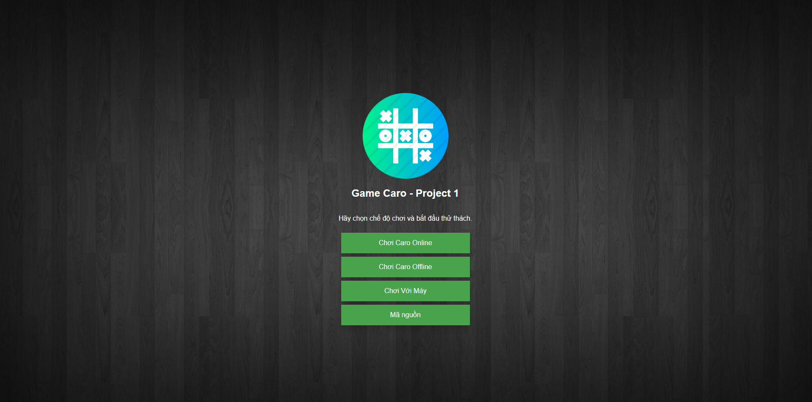

## Online (Create Room, Join Room & Leave Room)
The Online section consists of creating a room, joining a room, and leaving a room. In this section, there is a room creation feature with a generated code, and users can enter a room after successfully creating a code.

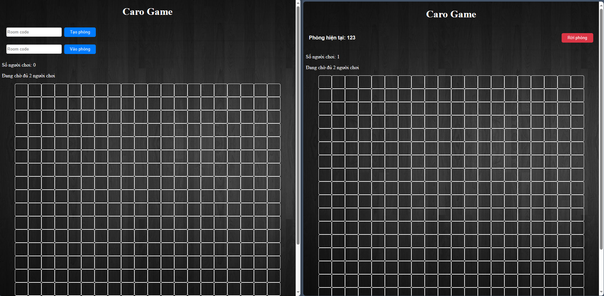

And when there are two players ready, the game can start. At this point, the roles of each player are displayed along with the remaining time for each player and their opponent. Each player is allotted 30 seconds for their turn

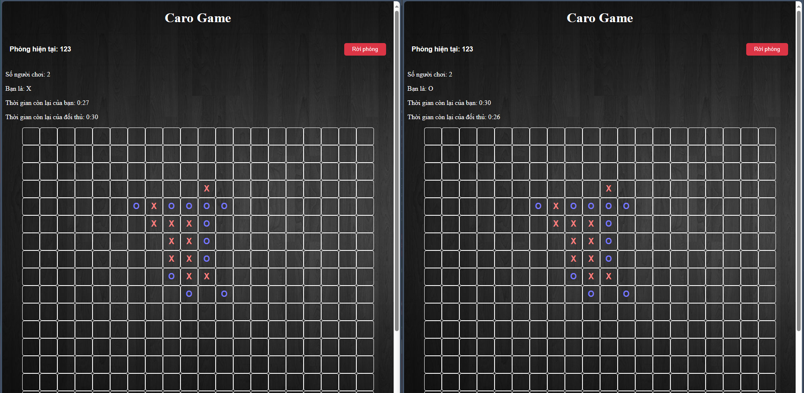

## Offline & Human vs Computer
In these two modes, some features have been removed compared to the online mode. Only the game board and the cells for making moves are present.

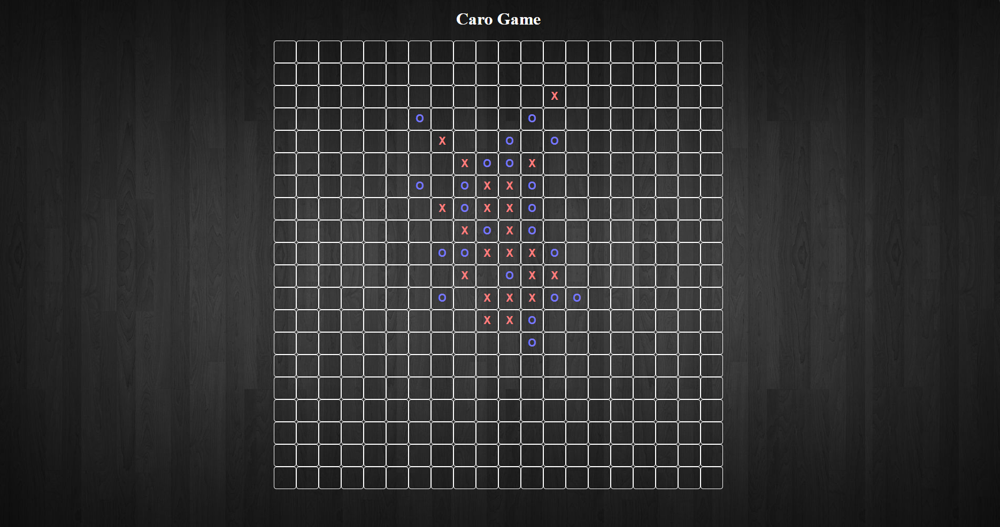

## Notification
### Create Room
#### Successfully
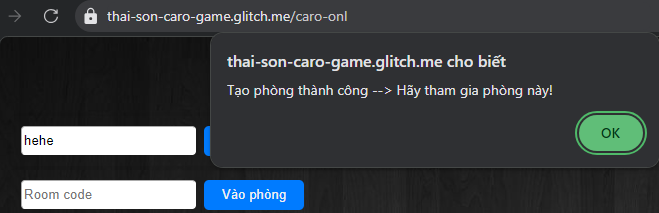

#### Error
The room already exists, so it cannot be created again.

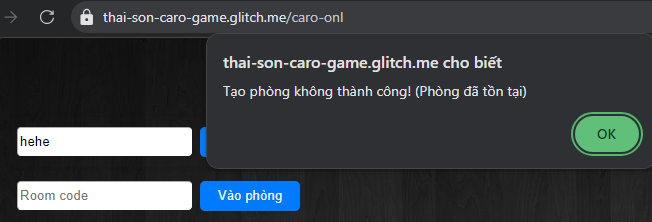

### Join Room 
#### Error 
The room does not exist or does not have enough players.

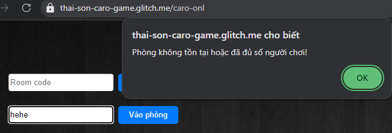

### Time's up!
#### The player's side timed out
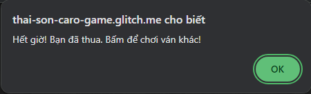

### The other player's side
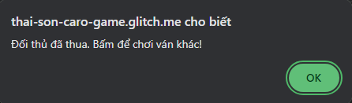

### Leave Room

When a player leaves the room for any reason, the remaining player will receive a notification and be automatically kicked out of the room.

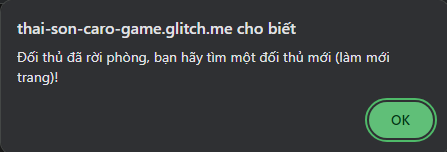

### Win
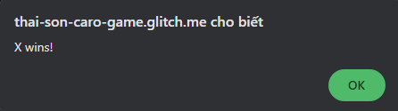