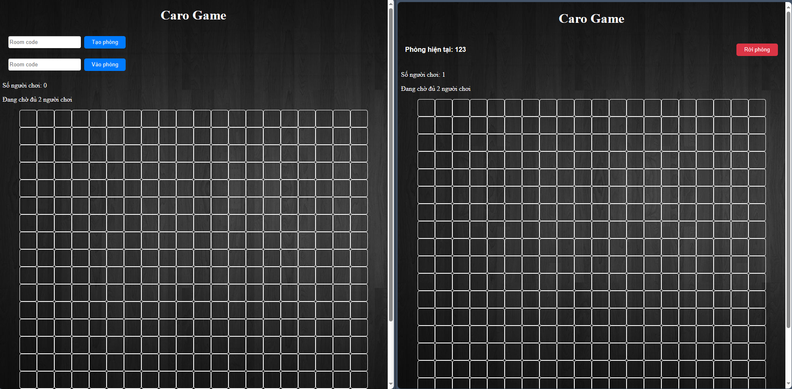
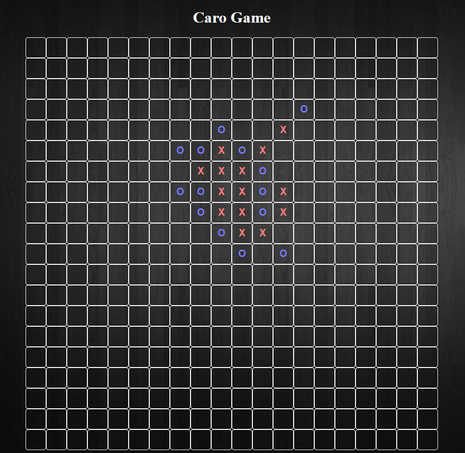

# Caro Game Project
## Giới thiệu (Introduction)
| Sản phẩm  | Caro Game                 |
| --------- | ------------------------- |
| Sinh viên | Đinh Thái Sơn             |
| MSSV      | 20210750                  |
| Frontend  | HTML, CSS, JavaScript     |
| Backend   | Flask (Python), WebSocket |

## Tổng quan về Project (Project Overview)
Xây dựng một game Caro cổ điển với các tính năng đa dạng để mang lại trải nghiệm độc đáo cho người chơi. Dưới đây là mô tả chi tiết về các tính năng chính của dự án:

### Đấu với máy (Single Player Mode):
- Sử dụng [giải thuật minimax](https://youtu.be/fTBEjsrZKso?si=RCymjDB1boUf3Eq8) để xây dựng chế độ này
- Các bước di chuyển của máy sẽ dựa trên tính toán các kết quả bao gồm có tấn công (cố gắng chiếm được 5 bước thẳng hàng) và phòng thủ (bảo vệ không cho đối thủ chiếm được 5 bước thẳng hàng) và chọn bước di chuyển ứng với kết quả tốt nhất trong sự kiện đó (nếu có nhiều kết quả có giá trị tấn công/phòng thủ bằng nhau thì sẽ random) 

### Đấu offline 2 người (Local Multiplayer Mode):
- Cho phép hai người chơi có thể chơi trên cùng một máy.
- Không sử dụng thuật toán, chỉ đơn giản kiểm tra chiến thắng khi có một trong hai người chơi đạt 5 bước thẳng hàng hoặc khi hết ô trống.

### Đấu online 2 người (Online Multiplayer Mode):
- Dựa trên chế độ đấu offline 2 người (Local Multiplayer Mode) với tính năng giúp 2 người chơi có thể thao tác game trên 2 thiết bị bất kỳ thông qua mạng Internet
- Socket Flask đóng vai trò làm cầu nối giữa 2 thiết bị trên server, sẽ tự động cập nhật các bước di chuyển và trạng thái của game giữa 2 người chơi
- Tính năng tạo mã phòng và tham gia phòng giúp những người chơi không bị xung đột khi tham gia game cũng như đạt tính bảo mật

### Máy đấu máy (Computer vs Computer Mode):
- Chế độ này xây dựng dựa trên thuật toán giữa người và máy. Sử dụng tính ngẫu nhiên giữa các bước di chuyển đạt điểm bằng nhau của giải thuật minimax, tạo ra các bước di chuyển khác nhau giữa hai máy, mô phỏng như hai người chơi thực sự đang chơi.

## Giao diện (Interface)
### Trang chủ


### Online (Create Room &  Join Room)


### Offline & Human vs Computer



## Demo
Bạn có thể trải nghiệm sản phẩm "Cờ caro" thông qua demo dưới đây của tôi: [Demo Caro Game Project](https://1df23f47-644a-4a2f-92f0-e2c1ed4d8666-00-1gbez3q37p9dp.pike.replit.dev/)

## Cấu trúc của project (Project Structure)
Project được tổ chức thành một ứng dụng Python Flask với tích hợp WebSocket để giao tiếp thời gian thực giữa những người chơi. Các thành phần chính của dự án bao gồm logic trò chơi, giao diện người dùng và chức năng nhiều người chơi.

```
Caro-Game-Project
├── app.py
├── __pycache__
│   └── game.cpython-39.pyc
├── README.md
├── static
│   ├── css
│   │   ├── styles-caro.css
│   │   └── styles-home.css
│   ├── images
│   │   └── logo.png
│   └── js
│       ├── caro-2computer.js
│       ├── caro-computer.js
│       ├── caro-off.js
│       ├── caro-onl.js
│       └── main.js
└── templates
    ├── caro-2computer.html
    ├── caro-computer.html
    ├── caro-off.html
    ├── caro-onl.html
    └── index.html
```

## Các yêu cầu trước khi chạy (Requirements)
Trước khi xây dựng và chạy dự án, cần đảm báo python cần có những thư viện sau:

```
# pip install flask
# pip install flask-socketio
# pip install python-socketio
# pip install jinja2
```

## Chạy trên local (Local Deployment)

Sau khi tải các thư viện đầy đủ, có thể chạy ứng dụng với câu lệnh sau:
```bash
python app.py
```

Hoặc chạy đoạn code sau để tự động tải project từ github về và chạy local: 
```python
# -*- coding: utf-8 -*-
import subprocess
import shutil
import os

caro_game_project_path = "Caro-Game-Project"
if os.path.exists(caro_game_project_path):
    shutil.rmtree(caro_game_project_path)

git_clone_command = "git clone https://github.com/spid3r1337/Caro-Game-Project.git"
subprocess.call(git_clone_command, shell=True)
subprocess.call("pip install flask", shell=True)
subprocess.call("pip install flask-socketio", shell=True)
subprocess.call("pip install python-socketio", shell=True)
subprocess.call("pip install jinja2", shell=True)


app_py_path = os.path.join(caro_game_project_path, "app.py")

if os.path.exists(app_py_path):
    command = "python {}".format(app_py_path)
    subprocess.call(command, shell=True)
else:
    print("File app.py not found in {}.".format(caro_game_project_path))
```

Xem trang http://localhost:8000/ (5000 là port mặc định của Flask, tuy nhiên ở trong app.py đã được thay đổi để chạy trên 0.0.0.0:8000) trong trình duyệt bất kỳ trên máy để vào game

## Liên hệ (Contact)
Son Dinh Thai: sondinh99999@gmail.com