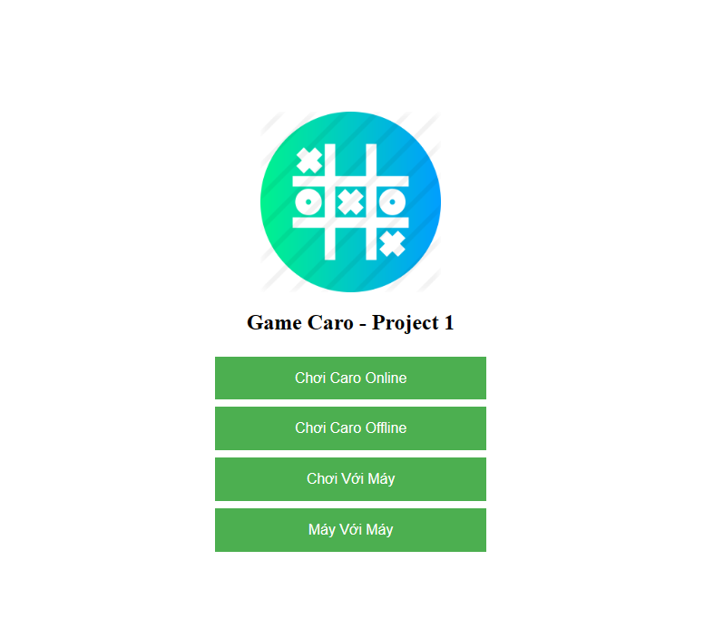

# Caro Game Project
## Introduction
| Sản phẩm  | Caro Game                        |
| --------- | -------------------------------- |
| Sinh viên | Đinh Thái Sơn                    |
| MSSV      | 20210750                         |
| Frontend  | HTML, CSS, JavaScript, bootstrap |
| Backend   | Flask (Python), WebSocket        |

## Interface
### Trang chủ



## Demo
Bạn có thể trải nghiệm sản phẩm "Cờ caro" thông qua demo dưới đây của tôi: [Demo Caro Game Project](https://project1caro.redipsspider.repl.co/)

## Project Overview
Sản phẩm là game Caro cổ điển với 4 tính năng chính:

### Single Player Mode (Đấu với máy):

Sử dụng [giải thuật minimax](https://youtu.be/fTBEjsrZKso?si=RCymjDB1boUf3Eq8) để xây dựng chế độ này

### Local Multiplayer Mode (Đấu offline 2 người):

Giúp 2 người chơi có thể chơi trên cùng 1 máy 

### Online Multiplayer Mode (Đấu online 2 người):

Giúp 2 người chơi có thể thao tác game trên 2 thiết bị bất kỳ thông qua mạng Internet:
- Socket Flask đóng vai trò làm cầu nối giữa 2 thiết bị trên server, sẽ tự động cập nhật các bước di chuyển và status của game giữa 2 người chơi
- Tính năng tạo mã phòng và tham gia phòng giúp những người chơi không bị xung đột khi tham gia game cũng như đạt tính bảo mật

### Online Multiplayer Mode (Máy đấu máy):

Xây dựng trên thuật toán giữa người và máy, lợi dụng tính "random" giữa các bước di chuyển đạt số điểm bằng nhau của giải thuật minimax tạo ra các bước di chuyển khác nhau giữa 2 máy mô phỏng như 2 người thật chơi

## Cấu trúc của project
Project được tổ chức thành một ứng dụng Python Flask với tích hợp WebSocket để giao tiếp thời gian thực giữa những người chơi. Các thành phần chính của dự án bao gồm logic trò chơi, giao diện người dùng và chức năng nhiều người chơi.

```
Caro-Game-Project
├── app.py
├── __pycache__
│   └── game.cpython-39.pyc
├── README.md
├── static
│   ├── css
│   │   ├── styles-caro.css
│   │   └── styles-home.css
│   ├── images
│   │   └── logo.png
│   └── js
│       ├── caro-2computer.js
│       ├── caro-computer.js
│       ├── caro-off.js
│       ├── caro-onl.js
│       └── main.js
└── templates
    ├── caro-2computer.html
    ├── caro-computer.html
    ├── caro-off.html
    ├── caro-onl.html
    └── index.html
```

## Requirements
Trước khi xây dựng và chạy dự án, cần đảm báo python cần có những thư viện sau:

```
# pip install flask
# pip install flask-socketio
# pip install jinja2
# pip install gevent
# pip install gevent-websocket
```

## Local Deployment
Sau khi tải các thư viện đầy đủ, có thể chạy ứng dụng với câu lệnh sau:
```bash
python app.py
```

Xem trang http://localhost:8000/ (5000 là port mặc định của Flask, tuy nhiên ở trong app.py đã được thay đổi để chạy trên 0.0.0.0:8000) trong trình duyệt bất kỳ trên máy để vào game
